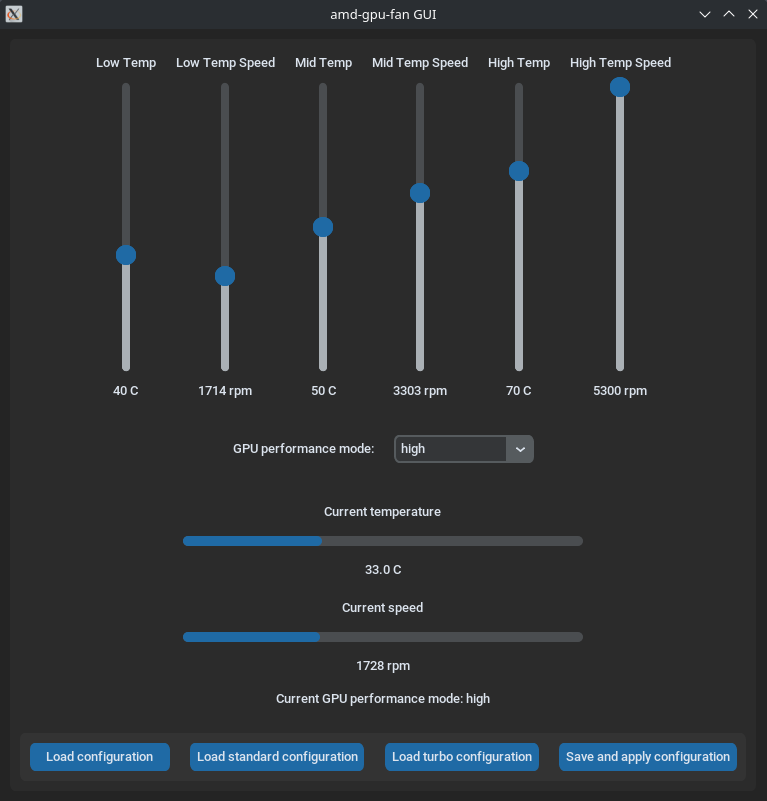

# AMD-GPU-Fan controller
This tool provides a daemon, a CLI and a GUI, allowing the user to create and manage profiles for GPU's fans


### DISCLAIMER
This tool only works with AMD GPUs, and is developed for Linux\
Feel free to extend its function for other Operative Systems, and if you do, please patch your changes and submit them as commits

Some GPUs are self-governed, meaning that it is not possible to create fan maps via software. \
In those cases, this software will not work

## Installation
Run the installation script as root
```commandline
sudo ./install.sh
```

## Usage
Both CLI and GUI allow to manage and create new configurations\
CLI usage is explained in the "help" section, just run `agf-cli --help`\
Creating a new configuration from CLI is a guided procedure, just follow the steps


GUI is self-explaning, needs no guide.
